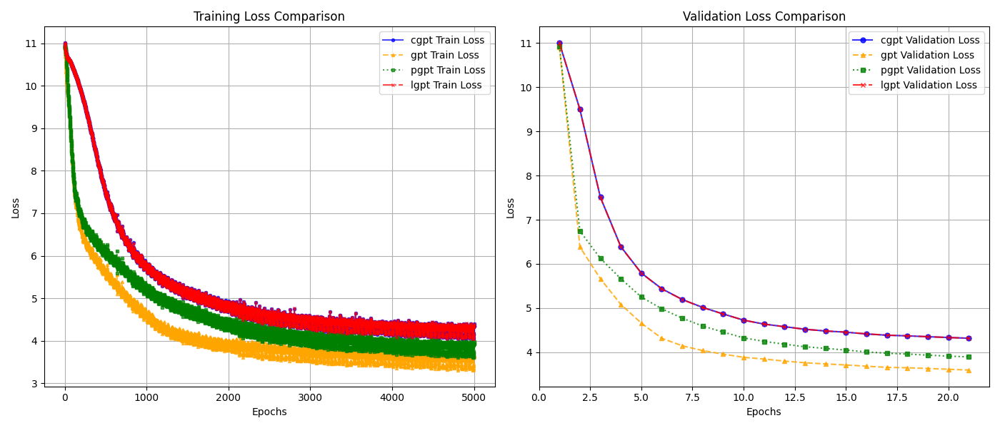

# gpt-variations
Code for the paper - [Towards smaller, faster decoder-only transformers: Architectural variants and their implications](https://arxiv.org/abs/2404.14462#:~:text=22%20Apr%202024%5D-,Towards%20smallers%2C%20faster%20decoder%2Donly%20transformers%3A,Architectural%20variants%20and%20their%20implications&text=Research%20on%20Large%20Language%20Models,only%20variations%20in%20%5B2%5D.)

The paper introduces the different variants of a decoder only transformer model that focuses on
- Getting similar results to a vanilla gpt model using lighter weight models with the same hyperparams
- Faster training and inference
- Less memory usage

## pgpt

- pgpt splits the number of layers in 2 parallel paths each with half the number of blocks  
- these parallel paths can be put on separate cores during training leading to faster training  
- during inference, blocks with less weights can be dropped

## cgpt and lgpt

- cgpt introduces 1d convolutional layers after every 2 decoder blocks  
- this reduces the dimensionality while having a performance similar to vanilla gpt  
- trains faster, less number of params and occupies less space

## loss curve

to update: model params and sizes, results on the benchmarks

benchmarks to evaluate on:
1. glue
2. superglue
3. snli
4. anli
5. squad
6. triviaqa
7. commonsenseqa
8. winogrande
